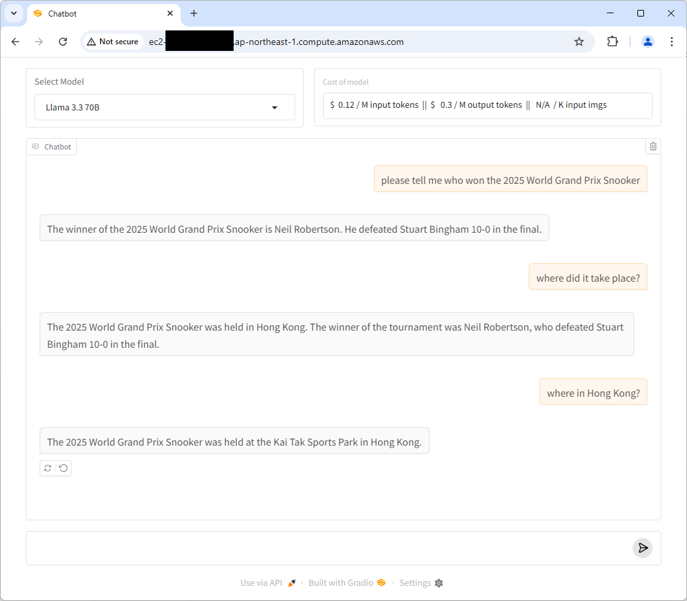

# Introduction

This is a local AI Agent chatbot with search engine function and model selection, using OpenRouter API in this development branch.

It currently supports mistral 24B, OpenAI, Llama, Gemini and Claude models.

Note: for some weaker model, it may fail to generate a json response for parsing and lead to "Error" in the web page



# TODO

1. Deploy to AWS [Done], currently used nginx, could consider kubernetes later
2. More available LLM models
3. Allow both ollama (local) and OpenRouter API LLM inference provider
4. Front-end using Vue instead of gradio
5. Logging

# Usage

```
git clone https://github.com/aa-crypto-ai/ai-agent-chatbot.git
cd ai-agent-chatbot
mkdir ~/.ai-agent-key
cp sample.env ~/.ai-agent-key/master.env
# put your tavily (search engine) and OpenRouter API key to master.env
docker build -t ai-agent-chatbot .
docker run -p 7860:7860 --volume ~/.ai-agent-key:/home/user/.ai-agent-key ai-agent-chatbot
```

Then you can access the chatbot at http://localhost:7860.
